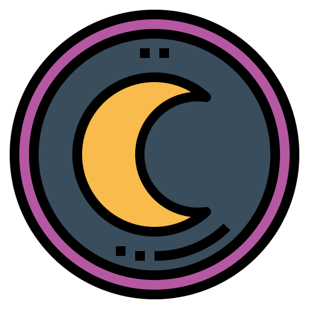

# Bootstrap responsive page (ChatGPT)
This webpage is through ChatGPT using Bootstrap to create templates and edit.  
Command ChatGPT creates templates and then manually fixes the incorrect parts. 
The LOGO on the top is used by combining the  with data-bs-toggle="offcanvas"  

    <nav class="navbar navbar-expand-lg navbar-light bg-light">
         

             

The navbar is created by ChatGPT, but not cited the BS but coded the CSS with @media search. 

    @media (max-width: 800px) {
      .d-flex {
        flex-direction: column;
      }
    }

    @media (max-width: 800px) {
      .navbar-collapse {
        position: absolute;
        top: 0;
        right: 60px;
        z-index: 1000;
        width: 80%;
        background-color: whitesmoke;
        padding: 10px;
        box-shadow: 0 0 20px rgba(0, 0, 0, 0.3);
        border-radius: 5px;
      }
